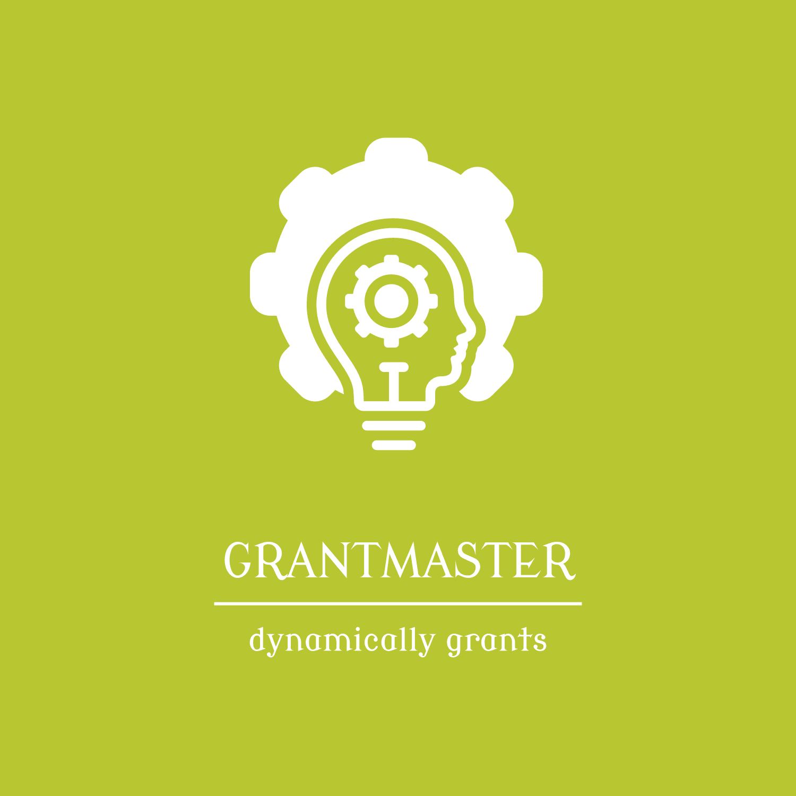

# GrantMaster



**GrantMaster** is a lightweight, Go-based tool that reads structured YAML/JSON policies and dynamically grants the appropriate database permissions in any database. Designed for efficiency, it leverages existing modules to minimize complexity while ensuring precise and secure access control.

## Features

- ✅ Parses YAML/JSON to define user roles and permissions  
- ✅ Grants, revokes, and manages database privileges dynamically  
- ✅ Supports integration with multiple database systems  
- ✅ Uses existing Go modules for efficiency and reliability  
- ✅ Provides logging and auditability for access management  

## GitOps Integration

**GrantMaster** can be easily integrated into **GitOps workflows**, allowing access policies to be managed declaratively through version-controlled repositories. This enables:  

- 🔹 Automated and consistent database access provisioning  
- 🔹 Auditability and traceability of access changes  
- 🔹 Infrastructure-as-code (IaC) best practices for security and compliance  

## Getting Started

### Installation

```sh
go install github.com/welibekov/grantmaster@latest
```

### Example of policy struct

```yaml
- username: david.gilmour
  roles:
    - write_all
- username: jimi.hendrix
  roles:
    - readl_all
    - write_all
```

### Then apply policy like
```sh
export GM_DATABASE_TYPE=fakegres

gm apply --policy policy.yaml
```

